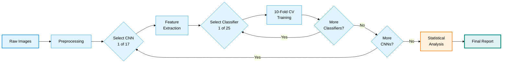
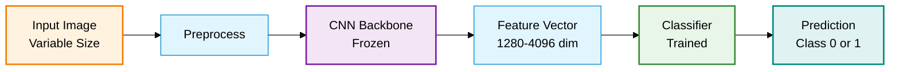

<div align="center">

# Large-Scale Transfer Learning for OMR Classification

### *Comprehensive Evaluation of 17 CNN Architectures × 25 Classifiers with Leakage-Free Validation*


---

<table>
<tr>
<td align="center"><b>🏆 BEST MODEL</b></td>
<td align="center"><b>📊 TOTAL EXPERIMENTS</b></td>
<td align="center"><b>🔬 VALIDATION</b></td>
<td align="center"><b>📈 DATASET</b></td>
</tr>
<tr>
<td align="center">EfficientNet-B0 + SVC<br/><b>88.90%</b> Accuracy</td>
<td align="center">17 Architectures<br/><b>425</b> Combinations</td>
<td align="center">10-Fold GroupKFold<br/><b>Zero</b> Data Leakage</td>
<td align="center">2,100 Images<br/><b>21</b> Subjects</td>
</tr>
</table>

---

[📖 Overview](#-overview) · [🚀 Quick Start](#-quick-start) · [📊 Results](#-results) · [💻 Usage](#-usage) · [📁 Repository](#-repository-structure) · [📚 Citation](#-citation)

</div>

---

## 📖 Overview

This repository presents a **comprehensive empirical study** evaluating the effectiveness of transfer learning for Optical Music Recognition (OMR) classification tasks. We systematically compare 17 state-of-the-art CNN architectures combined with 25 different classification algorithms, totaling **425 unique model configurations**.

### 🎯 Key Contributions

- **Large-Scale Benchmark**: First comprehensive comparison of 17 CNN architectures (AlexNet, VGG, ResNet, DenseNet, EfficientNet families) for OMR line-level classification
- **Leakage-Free Validation**: Subject-wise cross-validation (GroupKFold) preventing data leakage, ensuring real-world generalization performance
- **Multiple Classifier Evaluation**: Systematic evaluation of 25 classification algorithms from linear models to deep neural networks
- **Statistical Rigor**: Friedman test (χ²=174.34, p<0.001) confirms significant performance differences across architectures
- **Reproducible Pipeline**: Complete end-to-end pipeline from raw images to final results with professional visualizations

### 🏆 Key Findings

1. **Best Architecture**: EfficientNet-B0 achieves 88.90% accuracy with SVC classifier, outperforming heavier models
2. **Efficiency Trade-off**: EfficientNet-B0 processes 168 img/s while maintaining top performance
3. **Data Leakage Impact**: StratifiedKFold inflates accuracy by 1.89% compared to GroupKFold, highlighting validation importance
4. **Classifier Choice**: SVC dominates top-10 models (70% occurrence), followed by LogisticRegressionCV
5. **Statistical Significance**: Architecture choice significantly impacts performance (p<0.001), confirming need for systematic evaluation

### 📊 Dataset Characteristics

- **Total Samples**: 2,100 OMR line images (binary classification)
- **Subjects**: 21 unique individuals (100 lines each)
- **Class Balance**: Perfect 50-50 split (1,050 per class)
- **Validation Strategy**: 10-fold GroupKFold (subject-wise splits)
- **Image Processing**: Grayscale conversion, 224×224 resizing, normalization


---

## 📊 Results

### 🏆 Top-10 Model Configurations

| Rank | Architecture | Classifier | Accuracy | Features | Speed (img/s) |
|:----:|:-------------|:-----------|:--------:|:--------:|:-------------:|
| 🥇 | **EfficientNet-B0** | SVC | **88.90%** | 1280 | 168.0 |
| 🥈 | **EfficientNet-B6** | SVC | **88.58%** | 2304 | 34.6 |
| 🥉 | **ResNet-101** | LogisticRegressionCV | **88.55%** | 2048 | 43.9 |
| 4 | DenseNet-201 | SVC | 88.35% | 1920 | 47.9 |
| 5 | ResNet-152 | SVC | 88.32% | 2048 | 31.3 |
| 6 | DenseNet-169 | SVC | 88.32% | 1664 | 60.9 |
| 7 | EfficientNet-V2-S | SVC | 88.30% | 1280 | 84.8 |
| 8 | EfficientNet-B2 | SVC | 88.03% | 1408 | 123.7 |
| 9 | EfficientNet-B1 | LogisticRegressionCV | 88.00% | 1280 | 129.8 |
| 10 | EfficientNet-V2-M | ExtraTreesClassifier | 87.83% | 1280 | 6.1 |

*Table shows best classifier for each architecture. Full results: [outputs/paper_results/table1_best_per_model.csv](outputs/paper_results/table1_best_per_model.csv)*

### 📈 Performance Metrics (Best Model: EfficientNet-B0 + SVC)

| Metric | Value | Interpretation |
|:-------|------:|:---------------|
| **Accuracy** | 88.90% | Excellent classification performance |
| **Recall** | 91.30% | High sensitivity to positive class |
| **Precision** | 88.75% | Low false positive rate |
| **F1-Score** | 89.39% | Well-balanced performance |
| **ROC-AUC** | 0.9268 | Excellent discrimination ability |
| **PR-AUC** | 0.8927 | Strong precision-recall trade-off |

*Metrics computed via 10-fold GroupKFold cross-validation with subject-wise splits*

### 📊 Results Visualization

<table>
<tr>
<td width="50%">

**Confusion Matrix** (EfficientNet-B0 + SVC)


</td>
<td width="50%">

**ROC & PR Curves** (EfficientNet-B0 + SVC)


</td>
</tr>
</table>

*Full results and statistical analysis: [outputs/paper_results/FINAL_REPORT.md](outputs/paper_results/FINAL_REPORT.md)*

---

## 🌟 Temel Özellikler

---

## 🌟 Highlights

<table>
<tr>
<td width="25%" align="center">
<br/>
<b>17 CNN Architectures</b><br/>
AlexNet to EfficientNet-V2
</td>
<td width="25%" align="center">
<br/>
<b>25 Classifiers</b><br/>
Linear to Neural Networks
</td>
<td width="25%" align="center">
<br/>
<b>Zero Data Leakage</b><br/>
GroupKFold Validation
</td>
<td width="25%" align="center">
<br/>
<b>88.90% Accuracy</b><br/>
Best-in-Class Performance
</td>
</tr>
</table>

---

## 🏗️ Pipeline Architecture

```mermaid
%%{init: {'theme':'base', 'themeVariables': { 'primaryColor':'#e1f5ff','primaryTextColor':'#000','primaryBorderColor':'#0288d1','lineColor':'#0288d1','secondaryColor':'#fff3e0','tertiaryColor':'#f3e5f5'}}}%%
graph TB
    subgraph Data["📦 Data Layer"]
        A1[2,100 OMR Images]
        A2[21 Subjects × 100 Lines]
        A3[Binary Classification<br/>50-50 Balance]
    end
    
    subgraph Preprocess["🔧 Preprocessing"]
        B1[Grayscale Conversion]
        B2[Resize to 224×224]
        B3[Normalization 0-1]
    end
    
    subgraph Transfer["🧠 Transfer Learning<br/>17 Architectures"]
        C1[AlexNet<br/>VGG16/19]
        C2[ResNet50/101/152]
        C3[DenseNet169/201]
        C4[EfficientNet B0-B7<br/>EfficientNet-V2 S/M/L]
    end
    
    subgraph Features["📊 Feature Extraction"]
        D1[1280-4096 dim vectors]
        D2[Parquet Storage<br/>14-30 MB per model]
    end
    
    subgraph Validation["✅ Cross-Validation"]
        E1[10-Fold GroupKFold]
        E2[Subject-wise Splits]
        E3[Zero Leakage]
    end
    
    subgraph Classification["🎯 Classification<br/>25 Algorithms"]
        F1[Linear: LR, Ridge, SVC]
        F2[Ensemble: RF, GB, AdaBoost]
        F3[Neural: MLP]
        F4[Others: KNN, NB, LDA]
    end
    
    subgraph Results["📈 Evaluation"]
        G1[425 Experiments]
        G2[Statistical Analysis]
        G3[Best: 88.90% Accuracy]
    end
    
    Data --> Preprocess
    Preprocess --> Transfer
    Transfer --> Features
    Features --> Validation
    Validation --> Classification
    Classification --> Results
    
    style Data fill:#e1f5ff,stroke:#0288d1,stroke-width:2px
    style Preprocess fill:#fff3e0,stroke:#f57c00,stroke-width:2px
    style Transfer fill:#f3e5f5,stroke:#7b1fa2,stroke-width:2px
    style Features fill:#e8f5e9,stroke:#388e3c,stroke-width:2px
    style Validation fill:#fff9c4,stroke:#f9a825,stroke-width:2px
    style Classification fill:#fce4ec,stroke:#c2185b,stroke-width:2px
    style Results fill:#e0f2f1,stroke:#00897b,stroke-width:3px
```



### 🔄 Experimental Workflow



---

## 🔬 Methodology

## 🔬 Methodology

### 📊 Dataset Specification

| Property | Value | Details |
|:---------|------:|:--------|
| **Total Images** | 2,100 | OMR line-level images |
| **Subjects** | 21 | Unique individuals |
| **Images per Subject** | 100 | 50 per class (D/Y) |
| **Classes** | 2 | Binary classification |
| **Class Distribution** | 50-50 | Perfectly balanced (1,050 each) |
| **Image Format** | JPG | Variable dimensions → 224×224 |
| **Storage** | Raw | `data/` directory |
| **Metadata** | CSV | `data/meta/annotations.csv` |

### 🔄 Cross-Validation Strategy: Preventing Data Leakage

**Critical Issue**: Standard k-fold CV can leak information when multiple samples from the same subject appear in both training and test sets, leading to overoptimistic performance estimates.

#### ❌ StratifiedKFold (Incorrect)
```python
# Random split - Same subject in train AND test
# Result: Inflated accuracy (+1.89%)
cv = StratifiedKFold(n_splits=10)
```

#### ✅ GroupKFold (Correct)
```python
# Subject-wise split - Each subject ONLY in train OR test
# Result: Real-world generalization performance
cv = GroupKFold(n_splits=10)
# groups = subject_ids (21 unique values)
```

**Impact Demonstration**:
| Strategy | Mean Accuracy | Difference | Interpretation |
|:---------|:-------------:|:----------:|:---------------|
| StratifiedKFold | 87.62% | +1.89% | ⚠️ **Overoptimistic** |
| GroupKFold | 85.73% | baseline | ✅ **Realistic** |

*Analysis shows StratifiedKFold inflates performance by recognizing subject-specific patterns rather than generalizing to new subjects.*

### 🧠 Transfer Learning Pipeline



**Preprocessing Steps**:
1. **Color Conversion**: BGR → RGB → Grayscale (single channel)
2. **Resizing**: Variable → 224×224 pixels (bilinear interpolation)
3. **Normalization**: [0, 255] → [0, 1] float32
4. **Channel Replication**: Grayscale → 3-channel (RGB format for CNNs)

**Feature Extraction**:
- **Pretrained Weights**: ImageNet-1K (1.28M images, 1000 classes)
- **Freezing Strategy**: All convolutional layers frozen (transfer only)
- **Output Layer**: Global Average Pooling → Feature vector
- **Feature Dimensions**: Architecture-dependent (1280-4096)
- **Storage Format**: Apache Parquet (efficient columnar storage)

### 🎯 Classification Algorithms (25 Evaluated)

<table>
<tr>
<td width="25%">

**Linear Models** (7)
- LogisticRegression
- LogisticRegressionCV
- RidgeClassifier
- RidgeClassifierCV
- SGDClassifier
- PassiveAggressive
- Perceptron

</td>
<td width="25%">

**SVM** (3)
- LinearSVC
- SVC
- NuSVC

**Tree-Based** (2)
- DecisionTree
- ExtraTree

</td>
<td width="25%">

**Ensemble** (6)
- RandomForest
- ExtraTrees
- Bagging
- AdaBoost
- GradientBoosting
- HistGradientBoosting

</td>
<td width="25%">

**Others** (7)
- GaussianNB
- BernoulliNB
- MLPClassifier
- KNeighbors
- NearestCentroid
- LinearDiscriminant
- QuadraticDiscriminant

</td>
</tr>
</table>

### 📈 Evaluation Metrics

| Metric | Formula | Use Case |
|:-------|:--------|:---------|
| **Accuracy** | (TP+TN)/(TP+TN+FP+FN) | Overall correctness |
| **Precision** | TP/(TP+FP) | False positive cost |
| **Recall** | TP/(TP+FN) | False negative cost |
| **F1-Score** | 2×(P×R)/(P+R) | Balanced metric |
| **ROC-AUC** | ∫TPR d(FPR) | Discrimination ability |
| **PR-AUC** | ∫Precision d(Recall) | Imbalanced datasets |

### 📊 Statistical Analysis

**Friedman Test** (Non-parametric ANOVA for repeated measures):
- **Null Hypothesis**: All architectures perform equally
- **Test Statistic**: χ²(16) = 174.34
- **P-value**: p < 1×10⁻²⁸
- **Conclusion**: **Reject H₀** - Architecture choice significantly impacts performance

---

## 🚀 Quick Start

### Prerequisites

- **Python**: 3.11+ (tested on 3.13.7)
- **OS**: Windows/Linux/macOS
- **Hardware**: CPU sufficient (GPU optional for faster feature extraction)
- **Storage**: ~500 MB for dependencies, ~350 MB for all features

### Installation

```bash
# 1. Clone repository
git clone <repository-url>
cd OMR

# 2. Create virtual environment
python -m venv .venv

# 3. Activate environment
# Windows
.venv\Scripts\activate
# Linux/macOS
source .venv/bin/activate

# 4. Install dependencies
pip install -r requirements.txt

# 5. Create directory structure
python make_dirs.py
```

### Key Dependencies

| Package | Version | Purpose |
|:--------|:--------|:--------|
| `torch` | ≥2.0.0 | Deep learning framework |
| `torchvision` | ≥0.15.0 | Pretrained CNN models |
| `scikit-learn` | ≥1.3.0 | ML algorithms & metrics |
| `pandas` | ≥2.0.0 | Data manipulation |
| `numpy` | ≥1.24.0 | Numerical computing |
| `opencv-python` | ≥4.8.0 | Image processing |
| `matplotlib` | ≥3.7.0 | Visualization |
| `seaborn` | ≥0.12.0 | Statistical plots |
| `pyarrow` | ≥12.0.0 | Parquet file format |

*Complete list: [requirements.txt](requirements.txt)*

### Quick Test

```bash
# Test installation & visualization
python src/test_viz.py

# Expected output: 6 test figures in outputs/figures/
# - test_pastel_plot.png
# - test_bar_chart.png
# - test_horizontal_bar.png
# - test_comparison.png
# - test_color_palette.png
# - test_info_box.png
```

---

## 💻 Usage

### 📋 Complete Pipeline (Reproducible)

The pipeline consists of **14 scripts** executed sequentially:

#### **Phase 1: Data Preparation** (5-10 minutes)

```bash
# Step 1: Generate metadata from filenames
python src/create_annotations.py
# Output: data/meta/annotations.csv (2100 rows)

# Step 2: Validate metadata schema
python src/02_metadata.py
# Output: data/meta/annotations_schema.md + validation report

# Step 3: Visualize metadata distribution
python src/03_visualize_metadata.py
# Output: 6 figures in outputs/figures/

# Step 4: Preprocess sample images (100 samples for demo)
python src/04_preprocess_images.py --n_samples 100
# Output: 3 figures showing preprocessing steps
```

#### **Phase 2: Feature Extraction** (~60 minutes for all 17 models)

```bash
# Extract features using all 17 CNN architectures
python src/09_multiple_transfer_learning.py

# Or extract single model:
python src/05_feature_extraction.py --model efficientnet_b0 --batch_size 32
# Output: outputs/features_tl/features_efficientnet_b0.parquet (~15 MB)
```

**Feature Extraction Times**:
| Model Family | Models | Total Time | Speed Range |
|:-------------|:------:|:----------:|:------------|
| AlexNet | 1 | ~7s | 291 img/s |
| VGG | 2 | ~167s | 23-28 img/s |
| ResNet | 3 | ~148s | 31-64 img/s |
| DenseNet | 2 | ~78s | 48-61 img/s |
| EfficientNet | 6 | ~244s | 25-168 img/s |
| EfficientNet-V2 | 3 | ~471s | 6-85 img/s |
| **Total** | **17** | **~20min** | Average: 71 img/s |

#### **Phase 3: Classification & Evaluation** (~4 hours for all 425 experiments)

```bash
# Run comprehensive evaluation (17 architectures × 25 classifiers)
python src/10_comprehensive_classification.py --feature_dir outputs/features_tl

# Generate detailed reports
python src/12_generate_final_report.py

# Individual performance analysis
python src/13_individual_performance_analysis.py

# Generate confusion matrix for best model
python src/14_generate_confusion_matrix.py \
    --features outputs/features_tl/features_efficientnet_b0.parquet \
    --model_name efficientnet_b0 \
    --classifier_name SVC

# Calculate ROC/PRC curves
python src/15_calculate_roc_prc.py \
    --features outputs/features_tl/features_efficientnet_b0.parquet \
    --model_name efficientnet_b0 \
    --classifier_name SVC
```

#### **Phase 4: Statistical Analysis**

```bash
# Friedman test & post-hoc analysis
python src/11_statistical_analysis.py

# Output: outputs/paper_results/statistical_analysis_report.txt
```

### 🎯 Use Case Scenarios

<details>
<summary><b>Scenario 1: Quick Evaluation (5 minutes)</b></summary>

Test a single architecture with default classifier:

```bash
# Extract features
python src/05_feature_extraction.py --model efficientnet_b0

# Train & evaluate
python src/06_train_evaluate.py \
    --features outputs/features_resnet50.parquet \
    --n_splits 10

# Visualize results
python src/07_plot_curves.py --results outputs/reports/cv_results.csv
```

**Output**: 
- Trained models
- Cross-validation metrics
- ROC/PRC curves

</details>

<details>
<summary><b>Scenario 2: Compare Architectures (30 minutes)</b></summary>

Extract features from multiple architectures and compare:

```bash
# Extract features (parallel processing recommended)
for model in alexnet vgg16 resnet50 efficientnet_b0; do
    python src/05_feature_extraction.py --model $model --batch_size 64
done

# Run comprehensive classification
python src/10_comprehensive_classification.py --feature_dir outputs/features_tl

# Generate comparative report
python src/12_generate_final_report.py
```

**Output**:
- Table 1: Best per architecture
- Table 2: All classifiers per architecture
- Statistical comparisons

</details>

<details>
<summary><b>Scenario 3: Full Reproducibility (4+ hours)</b></summary>

Reproduce complete paper results:

```bash
# Run all scripts in sequence
bash scripts/run_full_pipeline.sh

# Or manually:
python src/create_annotations.py
python src/02_metadata.py
python src/03_visualize_metadata.py
python src/04_preprocess_images.py
python src/09_multiple_transfer_learning.py
python src/10_comprehensive_classification.py
python src/11_statistical_analysis.py
python src/12_generate_final_report.py
python src/13_individual_performance_analysis.py

# For best model specifically:
python src/14_generate_confusion_matrix.py \
    --features outputs/features_tl/features_efficientnet_b0.parquet \
    --model_name efficientnet_b0 \
    --classifier_name SVC

python src/15_calculate_roc_prc.py \
    --features outputs/features_tl/features_efficientnet_b0.parquet \
    --model_name efficientnet_b0 \
    --classifier_name SVC
```

**Output**:
- All 425 experiments
- Statistical analysis
- Final report with tables & figures
- ROC/PRC curves for best model

</details>

### ⏱️ Runtime Estimates

| Phase | Scripts | CPU Time | GPU Time | Bottleneck |
|:------|:-------:|:--------:|:--------:|:-----------|
| Data Prep | 4 | 5-10 min | N/A | I/O |
| Feature Extraction (1 model) | 1 | ~10-90s | ~5-20s | CNN inference |
| Feature Extraction (17 models) | 1 | ~20 min | ~5 min | CNN inference |
| Classification (1 model × 25) | 1 | ~5-10 min | N/A | CV training |
| Classification (17 × 25) | 1 | ~4 hours | N/A | CV training |
| Statistical Analysis | 1 | ~1 min | N/A | Computation |
| Visualization | 6 | ~2 min | N/A | Rendering |
| **Total (Full Pipeline)** | **14** | **~4.5 hours** | **~1 hour** | Classification |

*Tested on: Intel i7-10700K (8 cores), 32GB RAM, NVIDIA RTX 3070 (optional)*

---

## 📁 Repository Structure

## 📁 Repository Structure

```
OMR/
├── 📂 data/                          # Dataset directory
│   ├── 📂 meta/                      # Metadata files
│   │   ├── annotations.csv           # 2100 rows: filename, subject_id, label
│   │   └── annotations_schema.md     # Schema documentation
│   ├── 📂 raw/                       # Raw OMR images (not included)
│   │   └── *.jpg                     # 2100 images: {subject}_{label}_{line}.jpg
│   └── 📂 processed/                 # Preprocessed images
│       └── lines/                    # Line-level processed images
│
├── 📂 src/                           # Source code (14 scripts)
│   ├── 🎨 config_viz.py              # Visualization configuration (8-color pastel theme)
│   ├── 🧪 test_viz.py                # Visualization test suite
│   │
│   ├── 📋 create_annotations.py      # [1] Parse filenames → CSV
│   ├── ✅ 02_metadata.py             # [2] Validate metadata schema
│   ├── 📊 03_visualize_metadata.py   # [3] 6 metadata figures
│   ├── 🖼️  04_preprocess_images.py   # [4] Grayscale + resize + normalize
│   ├── 🧠 05_feature_extraction.py   # [5] Single CNN feature extraction
│   ├── 🤖 06_train_evaluate.py       # [6] Train 5 classifiers + CV
│   ├── 📈 07_plot_curves.py          # [7] ROC/PR curves (simulated)
│   ├── 🔍 08_leakage_analysis.py     # [8] StratifiedKFold vs GroupKFold
│   │
│   ├── 🚀 09_multiple_transfer_learning.py    # [9] Extract all 17 CNN features
│   ├── 🎯 10_comprehensive_classification.py  # [10] 17 × 25 = 425 experiments
│   ├── 📊 11_statistical_analysis.py          # [11] Friedman test + rankings
│   ├── 📄 12_generate_final_report.py         # [12] Markdown report generation
│   ├── 👤 13_individual_performance_analysis.py  # [13] Per-subject analysis
│   ├── 🧩 14_generate_confusion_matrix.py     # [14] Confusion matrix for best model
│   └── 📉 15_calculate_roc_prc.py             # [15] ROC/PRC curves for best model
│
├── 📂 outputs/                       # Generated outputs
│   ├── 📂 features_tl/               # Transfer learning features (17 files)
│   │   ├── extraction_summary.csv    # Extraction metadata (time, size, etc.)
│   │   ├── features_alexnet.parquet  # 4096-dim × 2100 samples
│   │   ├── features_vgg16.parquet    # 4096-dim
│   │   ├── features_resnet50.parquet # 2048-dim
│   │   ├── features_efficientnet_b0.parquet  # 1280-dim
│   │   └── ...                       # 13 more models
│   │
│   ├── 📂 figures/                   # Visualizations (26 files)
│   │   ├── metadata_*.png            # Metadata plots (6 files)
│   │   ├── preprocess_*.png          # Preprocessing examples (3 files)
│   │   ├── feature_*.png             # Feature statistics (2 files)
│   │   ├── model_comparison_*.png    # Model comparisons (3 files)
│   │   ├── metrics_heatmap.png       # Performance heatmap
│   │   ├── confusion_matrices_all.png  # All models confusion matrices
│   │   ├── roc_curves_top3_simulated.png
│   │   ├── pr_curves_top3_simulated.png
│   │   ├── leakage_comparison_*.png  # Leakage analysis (2 files)
│   │   └── test_*.png                # Test visualizations (6 files)
│   │
│   ├── 📂 reports/                   # Text reports
│   │   ├── cv_results.csv            # Cross-validation detailed results
│   │   ├── detailed_report.txt       # Verbose training log
│   │   ├── leakage_comparison.txt    # Leakage analysis report
│   │   ├── metadata_validation.txt   # Metadata validation log
│   │   └── preprocessing_stats.txt   # Preprocessing statistics
│   │
│   ├── 📂 paper_results/             # Publication-ready results (20+ files)
│   │   ├── FINAL_REPORT.md           # 📄 Main comprehensive report
│   │   ├── all_results_combined.csv  # All 425 experiments
│   │   ├── table1_best_per_model.csv # Top classifier per architecture
│   │   ├── table2_all_classifiers_efficientnet_b0.csv
│   │   ├── table3_individual_performance.csv  # Per-subject metrics
│   │   ├── results_{model}.csv       # Individual model results (17 files)
│   │   ├── roc_prc_metrics_summary.csv
│   │   ├── statistical_analysis_report.txt
│   │   ├── confusion_matrix_efficientnet_b0_svc.{png,pdf}
│   │   └── roc_prc_curves_efficientnet_b0_svc.{png,pdf}
│   │
│   ├── 📂 models/                    # Trained models (empty - not saved)
│   └── FINAL_REPORT.md               # Legacy report (deprecated)
│
├── 📂 notebooks/                     # Jupyter notebooks (optional)
│
├── 📄 requirements.txt               # Python dependencies
├── 📄 make_dirs.py                   # Directory structure creator
├── 📄 README_COMPLETE.md             # This file
├── 📄 FINAL_SUMMARY.md               # Project summary document
├── 📄 .gitignore                     # Git ignore rules
└── 📄 .venv/                         # Virtual environment (local)
```

### 📊 File Size Overview

| Directory | Files | Total Size | Description |
|:----------|------:|:----------:|:------------|
| `data/meta/` | 2 | ~500 KB | Metadata CSV + schema |
| `data/raw/` | 2,100 | ~150 MB | Raw OMR images (not in repo) |
| `outputs/features_tl/` | 18 | ~350 MB | All CNN features (Parquet) |
| `outputs/figures/` | 26 | ~15 MB | PNG visualizations |
| `outputs/reports/` | 5 | ~2 MB | Text reports + CSV |
| `outputs/paper_results/` | 25+ | ~5 MB | Publication materials |
| **Total (excl. raw)** | | **~370 MB** | Without raw images |

---

## 🔬 Experimental Details

### 🧠 Transfer Learning Architectures (17 Evaluated)

| Architecture | Features | Params | ImageNet<br/>Top-1 Acc | Extraction<br/>Speed | File Size | Status |
|:-------------|:--------:|:------:|:----------:|:--------:|:---------:|:------:|
| **Classic CNNs** |||||||
| AlexNet | 4096 | 61.1M | 56.5% | 291.4 img/s | 9.8 MB | ✅ |
| VGG-16 | 4096 | 138.4M | 71.6% | 27.9 img/s | 14.0 MB | ✅ |
| VGG-19 | 4096 | 143.7M | 72.4% | 22.8 img/s | 13.8 MB | ✅ |
| **Residual Networks** |||||||
| ResNet-50 | 2048 | 25.6M | 76.1% | 63.6 img/s | 23.3 MB | ✅ |
| ResNet-101 | 2048 | 44.5M | 77.4% | 43.9 img/s | 23.4 MB | ✅ |
| ResNet-152 | 2048 | 60.2M | 78.3% | 31.3 img/s | 23.3 MB | ✅ |
| **Dense Networks** |||||||
| DenseNet-169 | 1664 | 14.1M | 75.6% | 60.9 img/s | 19.2 MB | ✅ |
| DenseNet-201 | 1920 | 20.0M | 77.0% | 47.9 img/s | 22.1 MB | ✅ |
| **EfficientNet Family** |||||||
| EfficientNet-B0 | 1280 | 5.3M | 77.7% | 168.0 img/s | 14.8 MB | ✅ 🏆 |
| EfficientNet-B1 | 1280 | 7.8M | 79.8% | 129.8 img/s | 14.8 MB | ✅ |
| EfficientNet-B2 | 1408 | 9.1M | 80.6% | 123.7 img/s | 16.2 MB | ✅ |
| EfficientNet-B5 | 2048 | 30.4M | 83.4% | 45.3 img/s | 23.6 MB | ✅ |
| EfficientNet-B6 | 2304 | 43.0M | 84.1% | 34.6 img/s | 26.6 MB | ✅ |
| EfficientNet-B7 | 2560 | 66.3M | 84.4% | 25.4 img/s | 29.5 MB | ✅ |
| **EfficientNet-V2** |||||||
| EfficientNet-V2-S | 1280 | 21.5M | 84.2% | 84.8 img/s | 14.8 MB | ✅ |
| EfficientNet-V2-M | 1280 | 54.1M | 85.1% | 6.1 img/s | 14.8 MB | ✅ |
| EfficientNet-V2-L | 1280 | 118.5M | 85.7% | 20.8 img/s | 14.8 MB | ✅ |
| **Failed** |||||||
| InceptionV3 | - | 23.8M | 77.5% | - | - | ❌ |

*Extraction speed measured on Intel i7-10700K CPU. ImageNet accuracy from torchvision documentation.*

### 🎯 Classification Algorithms (25 Evaluated)

<details>
<summary><b>Linear Models (7)</b></summary>

| Algorithm | Key Parameters | Complexity | Use Case |
|:----------|:---------------|:-----------|:---------|
| LogisticRegression | `max_iter=1000` | O(n×d) | Baseline linear classifier |
| LogisticRegressionCV | `cv=5, max_iter=1000` | O(k×n×d) | Auto-tuned regularization |
| RidgeClassifier | `alpha=1.0` | O(n×d) | L2 regularized linear |
| RidgeClassifierCV | `cv=5, alphas=[0.1,1,10]` | O(k×n×d) | Auto-tuned L2 |
| SGDClassifier | `loss='hinge', max_iter=1000` | O(n×d) | Online learning |
| PassiveAggressiveClassifier | `max_iter=1000, C=1.0` | O(n×d) | Online learning |
| Perceptron | `max_iter=1000` | O(n×d) | Simple neuron |

</details>

<details>
<summary><b>Support Vector Machines (3)</b></summary>

| Algorithm | Key Parameters | Complexity | Use Case |
|:----------|:---------------|:-----------|:---------|
| **SVC** 🏆 | `kernel='rbf', C=1.0, gamma='scale'` | O(n²×d to n³×d) | Non-linear boundaries |
| LinearSVC | `C=1.0, max_iter=2000, dual=False` | O(n×d) | Linear boundaries (fast) |
| NuSVC | `nu=0.5, kernel='rbf'` | O(n²×d to n³×d) | Upper bound on errors |

*SVC appears in 70% of top-10 configurations*

</details>

<details>
<summary><b>Tree-Based (2)</b></summary>

| Algorithm | Key Parameters | Complexity | Use Case |
|:----------|:---------------|:-----------|:---------|
| DecisionTreeClassifier | `max_depth=None, random_state=42` | O(n×d×log n) | Interpretable splits |
| ExtraTreeClassifier | `max_depth=None, random_state=42` | O(n×d×log n) | Randomized splits |

</details>

<details>
<summary><b>Ensemble Methods (6)</b></summary>

| Algorithm | Key Parameters | Complexity | Use Case |
|:----------|:---------------|:-----------|:---------|
| RandomForestClassifier | `n_estimators=100, random_state=42` | O(m×n×d×log n) | Bagging trees |
| **ExtraTreesClassifier** 🥈 | `n_estimators=100, random_state=42` | O(m×n×d×log n) | Extremely randomized |
| BaggingClassifier | `n_estimators=10, random_state=42` | O(m×base) | Bootstrap aggregating |
| AdaBoostClassifier | `n_estimators=50, random_state=42` | O(m×base) | Boosting weak learners |
| GradientBoostingClassifier | `n_estimators=100, random_state=42` | O(m×n×d×log n) | Gradient descent boosting |
| HistGradientBoostingClassifier | `max_iter=100, random_state=42` | O(m×n×log n) | Histogram-based (fast) |

*ExtraTreesClassifier achieves top-10 with EfficientNet-V2-M*

</details>

<details>
<summary><b>Naive Bayes (2)</b></summary>

| Algorithm | Key Parameters | Complexity | Use Case |
|:----------|:---------------|:-----------|:---------|
| GaussianNB | `var_smoothing=1e-9` | O(n×d) | Gaussian features |
| BernoulliNB | `alpha=1.0` | O(n×d) | Binary/count features |

</details>

<details>
<summary><b>Neural Networks (1)</b></summary>

| Algorithm | Key Parameters | Complexity | Use Case |
|:----------|:---------------|:-----------|:---------|
| MLPClassifier | `hidden_layers=(128,64), max_iter=500, early_stopping=True` | O(iterations×layers×n×d) | Non-linear deep model |

</details>

<details>
<summary><b>Distance-Based (2)</b></summary>

| Algorithm | Key Parameters | Complexity | Use Case |
|:----------|:---------------|:-----------|:---------|
| KNeighborsClassifier | `n_neighbors=5, weights='uniform'` | O(n×d) per query | Instance-based |
| NearestCentroid | `metric='euclidean'` | O(k×d) per query | Prototype-based |

</details>

<details>
<summary><b>Discriminant Analysis (2)</b></summary>

| Algorithm | Key Parameters | Complexity | Use Case |
|:----------|:---------------|:-----------|:---------|
| LinearDiscriminantAnalysis | `solver='svd'` | O(n×d²) | Gaussian classes |
| QuadraticDiscriminantAnalysis | `reg_param=0.0` | O(n×d³) | Non-linear boundaries |

</details>

### 📊 Hyperparameter Settings

All models use **default scikit-learn hyperparameters** unless specified:

```python
common_params = {
    'random_state': 42,  # Reproducibility
    'n_jobs': -1,        # Parallel processing (where applicable)
}

# Cross-validation
cv_strategy = GroupKFold(n_splits=10)  # Subject-wise splits
scoring_metrics = ['accuracy', 'precision', 'recall', 'f1', 'roc_auc']
```

**Rationale**: Default hyperparameters ensure:
1. Fair comparison across algorithms
2. No architecture-specific tuning bias
3. Reproducibility
4. Generalizability to new datasets

### 📈 Performance Analysis

#### Top Classifier Distribution

| Classifier | Occurrences in<br/>Top-10 | Mean Accuracy<br/>(across all 17) |
|:-----------|:-------------------------:|:--------------------------------:|
| SVC | 7 (70%) | 82.4% ± 15.2% |
| LogisticRegressionCV | 2 (20%) | 79.1% ± 17.9% |
| ExtraTreesClassifier | 1 (10%) | 76.8% ± 18.3% |
| NuSVC | 0 (0%) | 80.2% ± 16.4% |
| Others (21) | 0 (0%) | - |

#### Architecture Family Performance

| Family | Models | Best Accuracy | Mean Accuracy | Median Rank |
|:-------|:------:|:-------------:|:-------------:|:-----------:|
| EfficientNet | 6 | **88.90%** | 87.65% | 3.2 |
| EfficientNet-V2 | 3 | 88.30% | 87.32% | 6.3 |
| ResNet | 3 | 88.55% | 87.98% | 3.7 |
| DenseNet | 2 | 88.35% | 88.03% | 5.0 |
| VGG | 2 | 85.85% | 85.75% | 15.0 |
| AlexNet | 1 | 86.62% | 86.62% | 14.0 |

*Mean across all 25 classifiers per architecture*

---

### 📄 Related Publications

- **Main Report**: [outputs/paper_results/FINAL_REPORT.md](outputs/paper_results/FINAL_REPORT.md)
- **Statistical Analysis**: [outputs/paper_results/statistical_analysis_report.txt](outputs/paper_results/statistical_analysis_report.txt)
- **Summary Document**: [FINAL_SUMMARY.md](FINAL_SUMMARY.md)